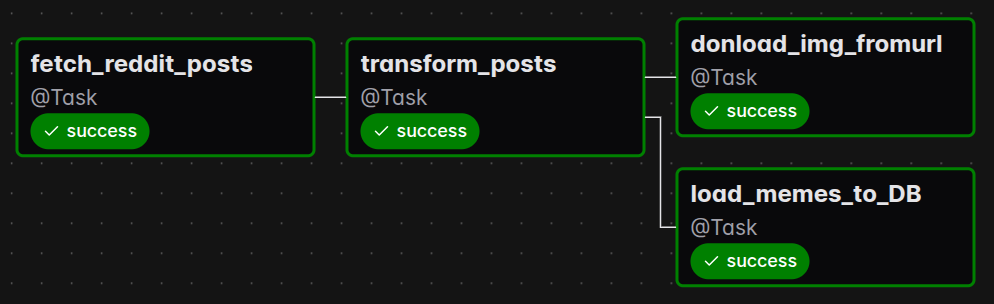
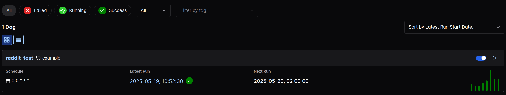
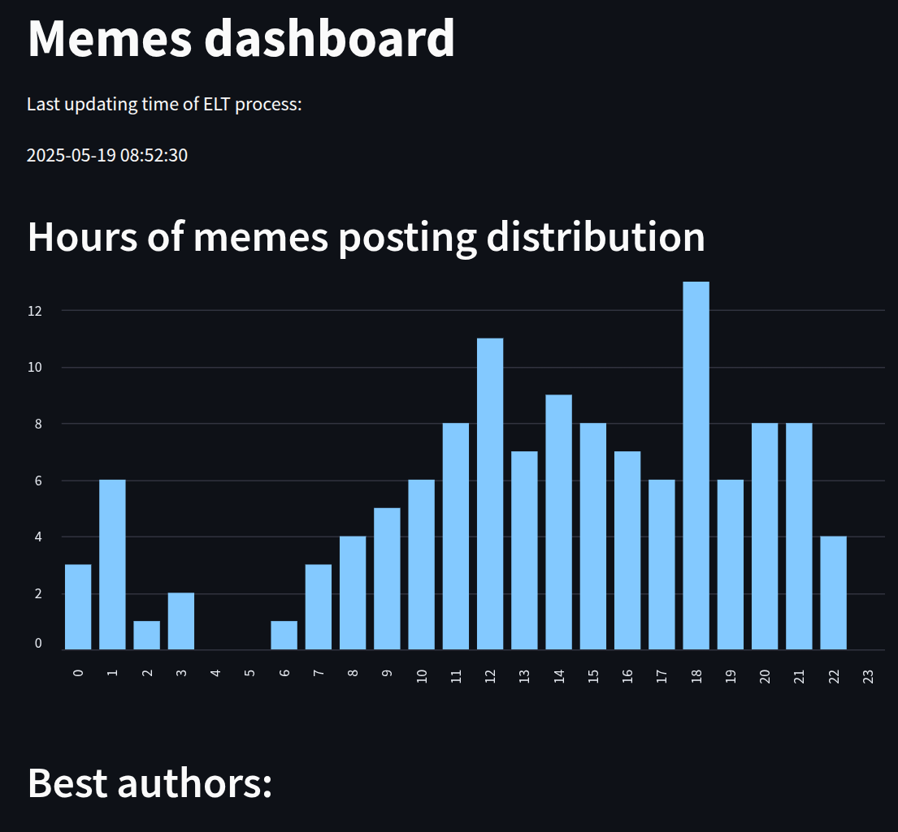
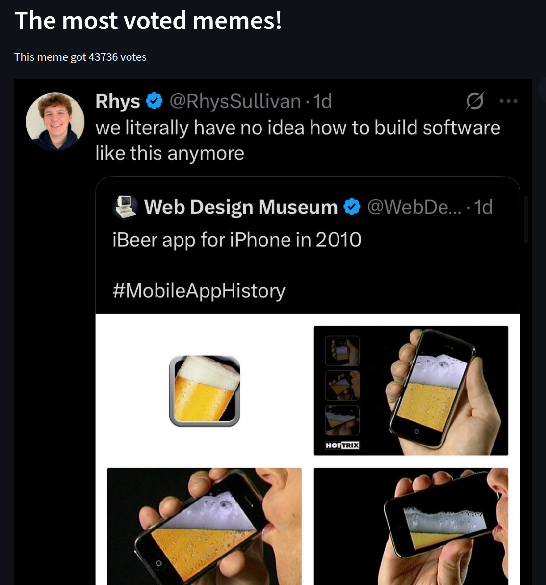

# Reddit memes ETL pipeline

The number of memes on the internet is large. However, finding really good ones is not easy, and manual searching can be time-consuming. This tool solves this problem by periodically searching the [Reddit](https://www.reddit.com/) website, choosing the best memes from them, storing them in a database, and providing a dashboard with basic statistics and the best memes.


This program is an Airflow ETL pipeline. Data are extracted from five main topics on Reddit by the [Prawn](https://praw.readthedocs.io/en/stable/) Python library. Next, only good memes (memes that have more than 50 votes) are filtered to ensure the best quality of the memes database. Selected records are stored in [PosgreSQL](https://www.postgresql.org/), and the meme images are stored in [minio](https://min.io/) - high-performance object storage, compatible with Amazon S3. 


Image below shows the DAG of the whole ETL pipline. 
<div style="text-align: center;">
  
</div>

Dag is running periodically every day to ensure that the end user is up to date with any new meme trends. Due to the high potential of memes to disrupt and distract from daily work, it is not recommended to change the schedule intervals to a more frequent one. (More on that [Deep work](https://www.amazon.com/Deep-Work-Focused-Success-Distracted/dp/1455586692))


## Setup

Get an authorization token from https://www.reddit.com/prefs/apps/. 

Create a .env file that will store some environmental variables.

```bash
touch .env
```

And paste your authorization token.
```
AIRFLOW_UID=1000
AIRFLOW_GID=0
REDDIT_CLIENT_ID=***
REDDIT_CLIENT_SECRET=***
REDDIT_USER=***
```

After that, you can start your Docker-Compose application. 

```bash
docker-compose up -d --build
```
After a moment, you should be able to get your access key for Airflow:
```bash
docker exec --user root -it <airflow-webserver_container_ID> cat simple_auth_manager_passwords.json.generated
```

Acess `http://localhost:8080/` and login. 

Trigger the reddit_test DAG.

<div style="text-align: center;">
  
</div>

After a moment, a DAG process should finish, and all extracted memes should be loaded into the DB.

## Dashbord
Along with the ETL process, a dashboard is also provided, allowing the display of basic statistics and top memes. The dashboard was created using the [streamlit](https://streamlit.io/) library. 

Acess `http://localhost:8501/` to see dashboard. 

<div style="text-align: center;">
  
</div>


<div style="text-align: center;">
  
</div>


## License

This project is licensed under the MIT License - see the [LICENSE](./LICENSE) file for details.
